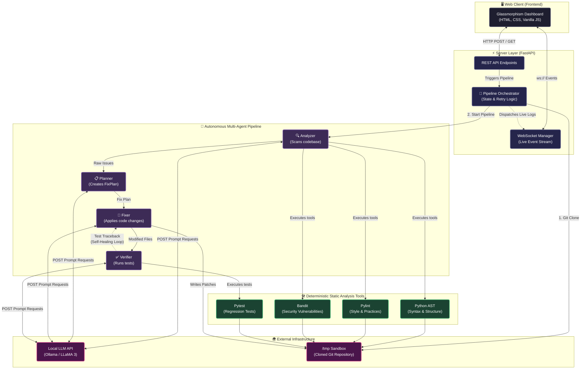

# 🏛️ Architecture & System Design

This document provides a high-level overview of the CodeSentinel AI architecture. Use this as a guide to explain the system's data flow, concurrency models, and agentic loop.

## 📊 1. System Architecture Diagram

## 🔄 2. Data Flow & Execution Walkthrough

When you explain the architecture in a video or interview, follow this 5-step flow:

### Step 1: The Request (Frontend ➔ FastAPI)
The user submits a GitHub URL or a Local Path via the UI. **FastAPI** establishes a **WebSocket** connection immediately so the frontend can listen to live updates.

### Step 2: The Sandbox (Orchestrator)
The **Orchestrator** intercepts the request and uses `GitTools` to clone the target repository into an isolated `/tmp` workspace. This ensures the user's original codebase is never permanently corrupted by AI changes.

### Step 3: Analysis (Anti-Hallucination)
The Orchestrator wakes up the **Analyzer Agent**. 
* **The Magic:** To prevent the LLM from hallucinating bugs, the Analyzer offloads the file reading to *deterministic Python tools* (`ast`, `pylint`, `bandit`). 
* Because these tools are CPU-bound and slow on large repos, they are pushed to a background thread using `asyncio.to_thread()`, keeping the FastAPI WebSocket alive and responsive.
* Once the tools return hard data (exact line numbers and severities), the Analyzer pings the **Local LLM (Ollama)** to write human-readable descriptions of the issues.

### Step 4: The ReAct Handoffs (Planner ➔ Fixer)
* **Planner Agent:** Takes the JSON list of issues, sends it to the LLM, and generates a strict, prioritized `FixPlan` (focusing on Critical/High bugs first).
* **Fixer Agent:** Reads the `FixPlan`, reads the specific files needing repairs, and uses the LLM to generate patched code, replacing the bad code on the disk in the temporary sandbox.

### Step 5: The Self-Healing Loop (Verifier)
* **Verifier Agent:** Runs `pytest` and `ast` syntax checks against the patched code. 
* **The Retry Loop:** If the test fails or throws a Python syntax error, the Orchestrator catches the traceback, sends it back to the Fixer Agent, and triggers a retry loop (`attempt < MAX_RETRIES`). The AI essentially debugs its own code before the user ever sees it.
* Once verified, the final payload—issues, fix plans, code diffs, and execution traces—is served back to the Frontend.

## 🧠 3. Core Principles
* **Separation of Concerns:** Using specialized agents makes prompting the LLM much cheaper and more accurate than asking one giant AI to do everything at once.
* **Deterministic Boundaries:** Using real tools (`pylint`, `ast`) restricts the AI from guessing.
* **Non-blocking IO:** FastAPI event loops handle networking while `asyncio.to_thread` handles the heavy code parsing.
