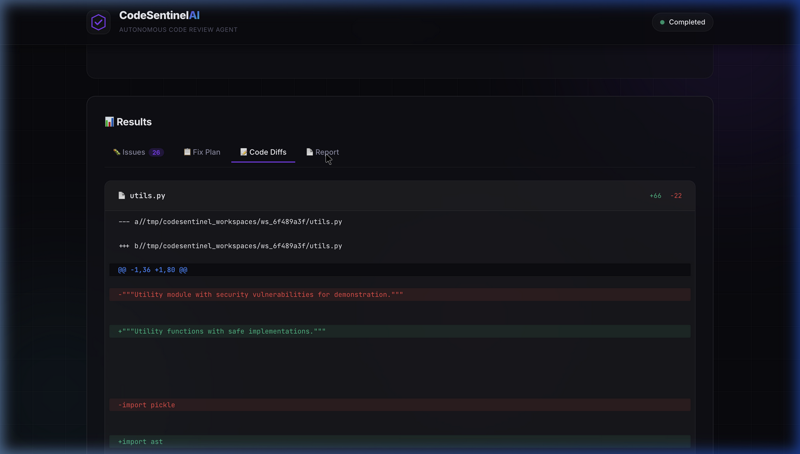
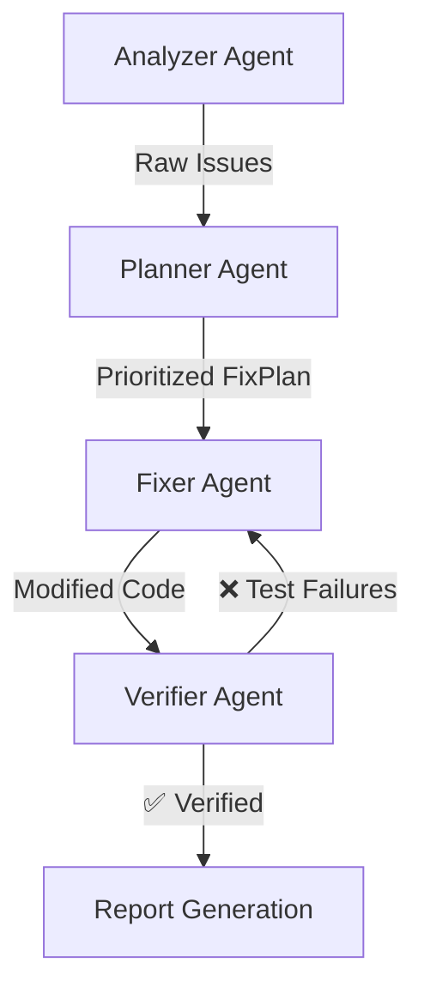
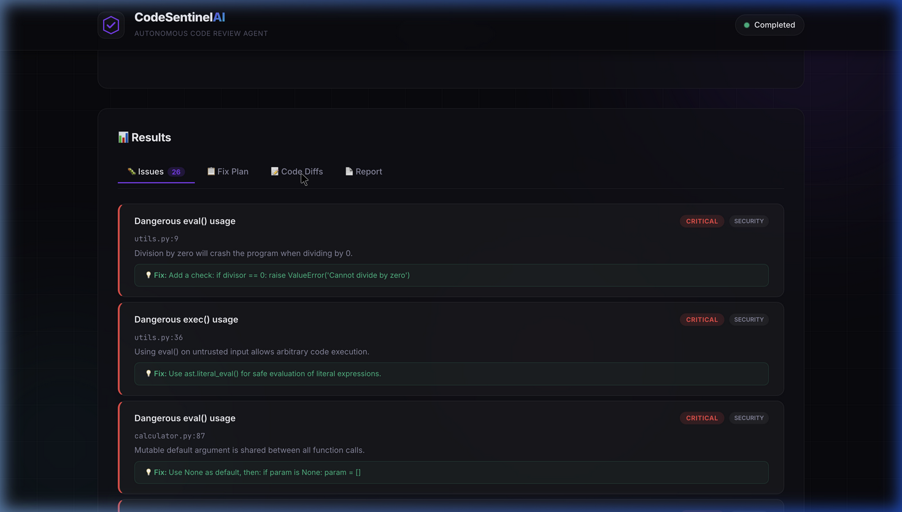

<div align="center">
  
  <h1>🛡️ CodeSentinel AI</h1>
  <p><strong>Autonomous Multi-Agent Code Review & Verification Pipeline</strong></p>

  <p>
    
    
    
    
  </p>
</div>

---

**CodeSentinel AI** is a professional-grade agentic workflow that actively seeks out bugs, maps out a fix strategy, autonomously patches the source code, and dynamically tests the changes before finalizing the review. It bridges the gap between raw LLM generation and deterministic Software Engineering safety.



## 🏗️ Core Architecture & Agentic Workflow

CodeSentinel implements the **ReAct (Reason + Act)** pattern via a custom orchestrator. Four specialized agents communicate through strict, Pydantic-typed data handoffs to eliminate unstructured generation errors.



### 🤖 The Specialized Agents
| Agent | Primary Role | Underlying Tools Used |
|-------|------|-----------|
| 🔍 **Analyzer** | Scans code for architectural bugs, security flaws, and code smells | `ast`, `pylint`, `bandit`, `radon` |
| 📋 **Planner** | Prioritizes tool outputs dynamically, ensuring foundation bugs are fixed first | Claude 3.5 Sonnet |
| 🔧 **Fixer** | Directly generates and applies semantic file-level AST modifications | Claude 3.5 Sonnet / Local LLMs |
| ✅ **Verifier** | Validates changes via isolated regression testing environments | `pytest`, `ast` syntax checker |

---

## ✨ Key Features

1. **Self-Healing Retry Loops:** When the Verifier detects a failing test after a code change, it captures the raw traceback and loops it back to the Fixer Agent up to 3 times to self-correct before human escalation.
2. **Deterministic Tool Use:** Eradicates hallucinations. The Analyzer does not guess where bugs are; it uses real Python tools (`bandit` for security, `radon` for complexity) and extracts metrics before ever consulting an LLM.
3. **Live WebSocket Streaming:** The FastAPI backend streams the agents inner monologues (e.g. `thinking`, `tool_use`, `action`) directly to the glassmorphism UI in real-time.
4. **Targeted Sandbox Execution:** Safely clones target GitHub repositories into isolated `/tmp` workspace directories to ensure original source trees are untouched until human approval.

---

## 🎨 Interactive Dashboard

The frontend isn't just a basic interface—it's a high-performance **Glassmorphism Dark-Mode Dashboard**. 
- Live parallel agent progress tracking
- Interactive visual color-coded code diffs
- Real-time logging



---

## 🚀 Quick Start

### 1. Clone & Setup
```bash
git clone https://github.com/Nithinchalamchala/CodeSentinelAI.git
cd CodeSentinelAI
python3 -m venv venv
source venv/bin/activate
pip install -r requirements.txt
```

### 2. Configure Environment
```bash
cp .env.example .env
# Open .env and add your ANTHROPIC_API_KEY
```

### 3. Run the Backend & Dashboard
```bash
source venv/bin/activate
python -m uvicorn backend.main:app --port 8000
```
Navigate to **`http://localhost:8000`** in your browser. Paste any GitHub URL or local repository path and watch the agents go to work!

---

## 🧪 Demo Built-In
The project includes a sample `buggy_calculator` project packed with intentional vulnerabilities (Division by Zero, `eval()` injections, mutated defaults, bare exceptions). Select **"Try Demo"** in the UI to watch the AI effortlessly detect, plan, and patch 26 separate issues within 3 seconds.

---

> Built by **Anjaninithin Chalamchala** as an applied demonstration of complex agentic workflows, deterministic AI boundaries, and high-performance Python application engineering.
